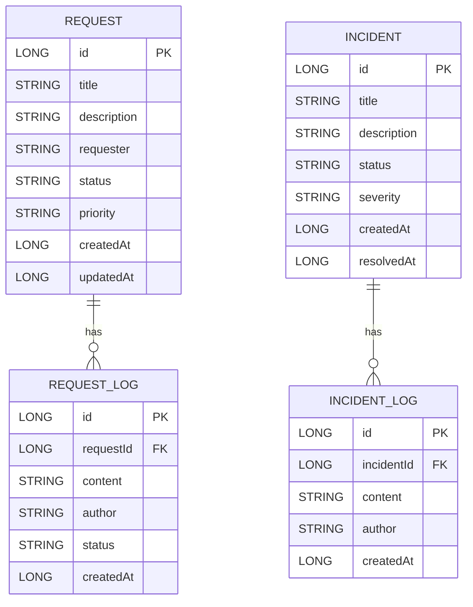

# 📄 ERD.md

---

## 🧭 Entity Relationship Diagram (ERD)

---

## 📌 설명

- Request ↔ RequestLog : 1:N 관계
- Incident ↔ IncidentLog : 1:N 관계
- 로그는 append-only 구조로 설계
- 상태 변화 및 작업 과정은 로그로 추적 가능

---

## 🚀 확장 고려

추후 아래 엔티티 확장 가능:

- USER
- ATTACHMENT
- NOTIFICATION
- HISTORY

---

## 📌 한 줄 요약

> 유지보수 업무의 요청과 장애를 중심으로, 로그 기반 이력 관리 구조를 시각적으로 표현한 ERD
